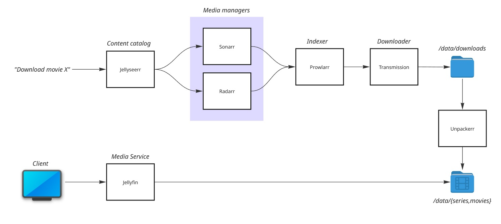
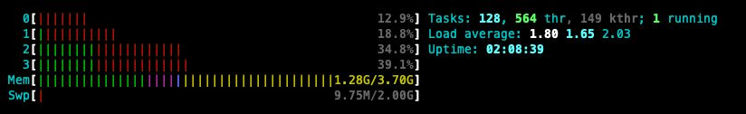

# Jellystack



## Requirements

- Docker (compose)
- At least 4 GB RAM
- At least 4 cores (Cortex-A72 or superior)
- A VPN service such as NordVPN or Surfshark is **strongly** advised.

### CPU/Memory utilization on a Raspberry Pi 4 B

While this is not a true benchmark, streaming (1080p) with embedded subtitles
typically shows the following usage:


### Directory structure

Before running the `compose.yml`, the following directory structure needs to be
present in the host:

```
/data/
├── bazarr
│   └── config
├── config
├── downloads
│   ├── complete
│   │   ├── radarr
│   │   └── tv-sonarr
│   └── incomplete
├── jellyfin
├── jellyseerr
├── movies
├── prowlarr
├── radarr
├── series
├── sonarr
├── transmission
├── tv
└── watch
```

> **💡 Tip!** Mount any of these volumes to external devices (NAS, for example)
> if you wish more storage, pay attention to `tv`, `movies`, and `downloads` as
> these will host large media files.

#### One-liner to create the directory structure:

```bash
mkdir -p /data/{bazarr/config,config,downloads/{complete/{radarr,tv-sonarr},incomplete},jellyfin,jellyseerr,movies,prowlarr,radarr,series,sonarr,transmission,tv,watch}
```

We will mount these directories as volumes for the services defined in `compose.yml`.


## Getting access to the services

As configured by `compose.yml`, services are acessible via their web UI.

Add the IP address of your Raspberry Pi (or any other single board computer or
server) to your computer host files, example using `media.center.local`:

```
# localhost name resolution is handled within DNS itself.
#	127.0.0.1       localhost
#	::1             localhost
192.168.1.100       media.center.local
```

Alternatively, in most Wifi routers (access points) you have the option to configure
internal DNS records, example (Odido NL, Zyxel EX5601-T1):

<p align="center">

</p>

While not necessary, this will allow accessing services with a proper name, such as:

|Service|Endpoint|
|---|---|
|transmission|http://media.center.local:9091/|
|prowlarr|http://media.center.local:9696/|
|radarr|http://media.center.local:7878/|
|sonarr|http://media.center.local:8989/|
|jellyseerr|http://media.center.local:5055/|
|jellyfin|http://media.center.local:8096/|
|bazarr|http://media.center.local:6767/|

> **💡 Tip!** Disable DHCP client on the `media.center.local` and setup the IP
> address manually to prevent unexpected changes.

## Configuration

### *arr

Authentication is required in all *arr stack, when accessing for the first time
you will be prompt with the following screen:

<p align="center">

</p>

* Disable for local addresses;
* Set username and password.

### Radarr & Sonarr

Radarr and Sonarr are both media managers, the former handles movies and the
later series (anything with episodes). They are essentially the same project and
therefore must be configured similarly.

Open Radarr/Raweb UI, navigate to `Settings` (left side menu), and under:

- **Media Management:**
    - Select: Rename movies
    - Select: Replace illegal characters
    - Verify if the Root Folder section lists the `/movies` folder for Radarr, or `/tv` for Sonarr.
        - Example:
 
<p align="center">
    
</p>
  
- **Profiles:**
    - Add your prefered profiles for video downloads (1080P, 720P). By default
      the media manager will download the highest available quality, which
      consists of files typically above 40GB.
- **Indexers:**
    - It will automatically list Prowlarr once it is configured. Leave blank for
      now.
- **Download Clients**:
    - Setup Transmission as a download client.
        - Host: `transmission`
        - Port: `9091`
        - Username: `<username>`
        - Password: `<password>`
- **Connect:**
    - Optionally you can setup notification services here, such as Telegram,
      Discord, Slack, and so on.


### Prowlarr

Open Prowlarr UI, navigate to `Indexers` (left side menu) and add your prefered
indexers. These indexers are used by Prowlarr when looking for files to
download. Make sure to have at least 3-4 good indexers in place. Search on-line
for advice on the best indexers for the content you're looking for.

You also need to configure Prowlarr to receive requests from media managers by
navigating to `Settings` (left side menu), and under:

- **Apps:**
    - Copy the API keys for Sonarr and Radarr (under their UI nagivate to
      `Settings > General > Api Key`). Add the apps here one by one:
        - Radarr: `http://radarr:7878` + Radarr API key
        - Sonarr: `http://sonarr:8989` + Sonarr API key
            - Example:
     
<p align="center">

</p>

- **Download Clients**:
    - Setup Transmission as a download client (similar to Sonarr/Radarr).
        - Host: `transmission`
        - Port: `9091`
        - Username: `<username>`
        - Password: `<password>`


### Jellyfin

Generate an API key to used with Jellyseerr. Navigate to `Settings > Dashboard`,
then `API Keys` (left side menu), click `New API Key`, name it `Jellyseerr` or
any other friendly name. Copy the key as it will be used in the following step
(below).
Navigate to `Libraries` and add a Movie and Shows library, make sure to add the folder (`/data/tvshows` and `/data/movies`).

### Jellyseerrr

Open Jellyserr UI, navigate to `Settings > Jellyfin` and configure add the
Jellyfin hostname, port and API Key obtained in the previous step.

Under `Settings > Services` add both Radarr and Sonarr services (hostname, port
and API key needed for each.)

## Clients

### 📺 Samsung TV

To install Jellyfin app on Samsung TV (>2018) use the following un-official
installer: https://github.com/PatrickSt1991/Samsung-Jellyfin-Installer

### 📺 Android TV

The official package is provided for Android TV clients:
https://github.com/jellyfin/jellyfin-androidtv

### Other clients

https://jellyfin.org/downloads/clients/
